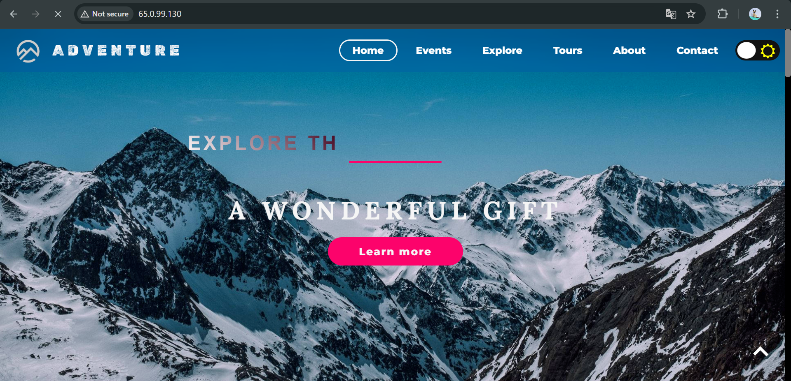
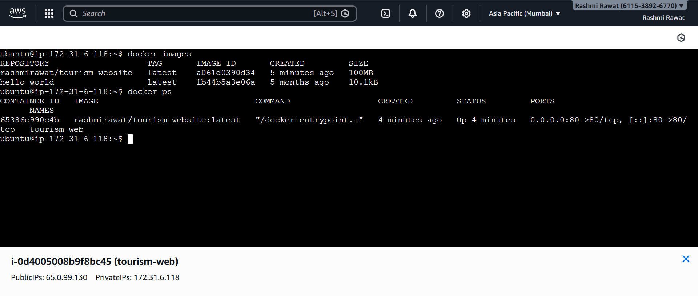

# Tourism Website

ADVENTURE - "Where Every Journey Begins"
A beautiful, responsive tourism website showcasing travel destinations, packages, and experiences.

## Project Features
- Responsive design (mobile + desktop)
- Modern UI with attractive sections (Home, Destinations, Packages, Gallery, Contact)
- Static site served with Nginx
- Containerized with Docker
- Automatic deployment to AWS EC2 using GitHub Actions

## Tech Stack
- Frontend Technology
Pure/static web stack: HTML + CSS3 + JavaScript 
Responsive design (mobile-first approach)
- Web Server Layer
Nginx → lightweight, high-performance static file server
Chosen for speed, low resource usage, and excellent static content delivery
- Containerization
Docker → single container approach
Principle: "Build once, run anywhere" + environment consistency
Image contains both application files + web server
- CI/CD & Automation
GitHub Actions → event-driven pipeline (push to main → trigger)
Two-stage pattern:
Build → package → publish artifact (Docker image → registry)
Deploy → remote execution on production server
Uses native commands only (no heavy third-party actions)
- Hosting/Infrastructure
AWS EC2 → single virtual machine (IaaS)
Simple, cost-effective for low-traffic personal/portfolio sites
Manual SSH-based deployment bridge (secure key authentication)
- Deployment Philosophy
Immutable deployments (new image → new container, old one replaced)
Zero-downtime-ish update via stop/rm/run sequence
Use of :latest tag for simplicity (trade-off: loses strong versioning)

## Deployment Architecture
Developer's changes
          ↓ (git push)
GitHub Repository (main branch)
          ↓ (event trigger)
GitHub Actions (CI/CD pipeline)
   ┌───────────────┐
   │               │
   ▼               ▼
Build Stage    Deploy Stage
   │               │
   ▼               ▼
Container       Remote Server
Image           (AWS EC2 Instance)
   │               │
   ▼               ▼
Docker Hub     Docker Engine
(registry)         running
                      │
                      ▼
                 Nginx Container
                 serving static files
                      │
                      ▼
                 Public Internet
                 (port 80 / HTTP)

## Learning
- Package application + web server together (Docker + Nginx)
- Store the package in a central, accessible place (registry)
- Describe the desired state as code (workflow file)
- Automatically move to production when source code changes (event → build → deploy)
